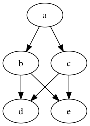
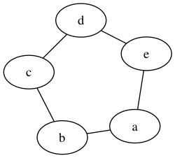
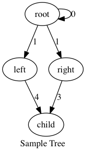

# pygraph
pygraph is an extremely simple CLI tool for using graphviz. It takes a file to write to and
adjacency list to construct the graph from. The intended use case is for generating
small graphs to embed in things like homework problems. The API is documented via the `--help`
option

## Usage
```bash
$ pygraph --help
Usage: pygraph [OPTIONS] FILE EDGES...

Options:
  -e, --engine [dot|neato|twopi|circo|fdp|sfdp|patchword|osage]
  -u, --undirected / -d, --directed
  --format TEXT
  --help                          Show this message and exit.
```

## Syntax
* Pairs of single characters are interpretted as creating an edge between the first and second
* Nodes can have any name when separated by `-` (eg: `root-child`)
* To label the edge, append `:` and any text (eg: `root-child:label`)
* Name the image by passing `-n` option

### Examples
```bash
pygraph -d tree ab ac bd be
```



```
pygraph -u -e neato circle ab bc cd de ea
```



```
pygraph -d -n "Sample Tree" labeled-tree root-left:1 root-right:1 left-child:4 right-child:3 root-root:0
```


